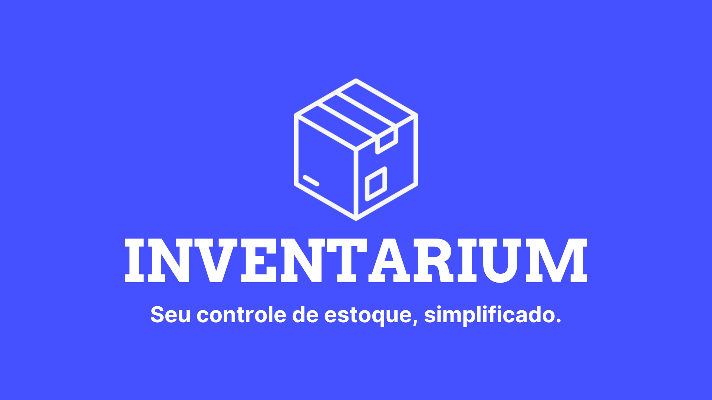

<p align="center">
  
</p>
 
Seu controle de estoque, simplificado.

O **Inventarium** é uma plataforma intuitiva e acessível de controle de estoque, criada para descomplicar a gestão de produtos em pequenas e médias empresas.  
Nosso foco é a **usabilidade**, permitindo que qualquer usuário consiga cadastrar, gerenciar e acompanhar movimentações de estoque de forma rápida e confiável.  

---

## Problema
- Gestão em planilhas arcaicas, propensas a falhas.  
- Falta de experiência da equipe com softwares de gestão complexos.  
- Processos lentos e burocráticos.  
- Necessidade urgente de uma solução simples e automatizada.  

---

## Solução
- Plataforma intuitiva e de fácil uso.  
- Funcionalidades rápidas e acessíveis.  
- Minimização de erros operacionais.  
- Design focado na experiência do usuário.  

---

## Funcionalidades
- Cadastro de produtos (código do fabricante, marca, localização, garantia, descrição, valor e quantidade).  
- Movimentações de estoque (entrada e saída).  
- Histórico completo de operações.  
- Listagem organizada e pesquisável de itens.  

---

## Estrutura do Projeto

### Frontend (Angular)
- Interface web responsiva.  
- Tecnologias: Angular, TypeScript, Bootstrap, CSS.  

### Backend (Java + Spring Boot)
- API REST para cadastro e movimentações.  
- Tecnologias: Java 21, Spring Boot, Maven, Banco de Dados (MySQL/PostgreSQL).  

---

## Como Executar o Projeto

### Pré-requisitos
- Node.js (>=18)  
- Angular CLI  
- Java 21  
- Maven  
- Banco de Dados MySQL ou PostgreSQL  

### Passos
```bash
# Executar o frontend
cd inventarium-frontend
npm install
ng serve
# Acesse em: http://localhost:4200

# Executar o backend
cd inventarium-backend
mvn spring-boot:run
# API disponível em: http://localhost:8080
